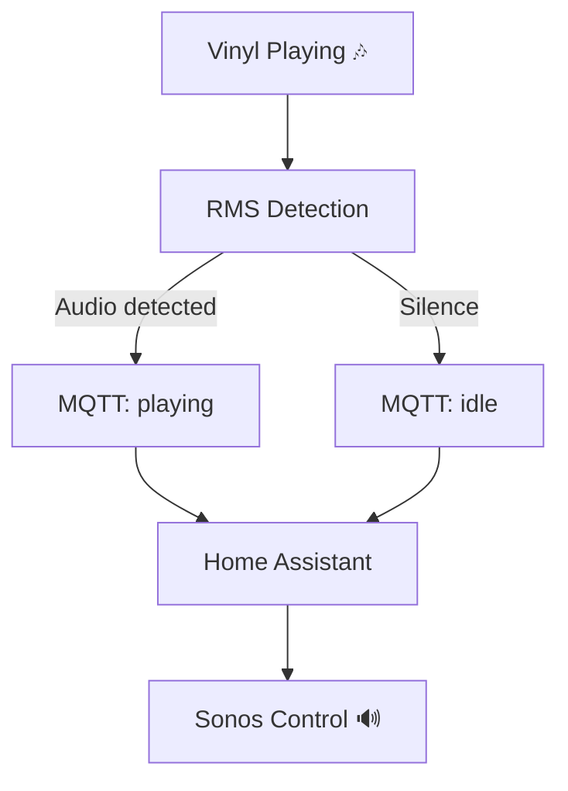

# 🎧 turntable-mqtt-bridge


> 🌀 Turn your **vinyl turntable** into a smart, automated audio source with MQTT + Home Assistant + Sonos.

---

## ✨ Features

* 🎶 Automatic **vinyl playback detection** (RMS audio analysis)
* 📡 Publishes state via **MQTT**
* 🏠 Seamless **Home Assistant automation**
* 🔊 Auto-switch & play on **Sonos speakers**
* ⚡ Lightweight, runs on a **Raspberry Pi Zero**

---

## 🏗️ Architecture

```text
USB Turntable
      ↓
Raspberry Pi (Darkice)
      ↓
Icecast (MP3 stream)
      ↓
vinyle_monitor.py (RMS detection)
      ↓
MQTT Broker (Mosquitto)
      ↓
Home Assistant
      ↓
Sonos Speaker 🔊
```

---

## 🧰 Hardware

* 🥧 Raspberry Pi (Zero / 3 / 4)
* 🎚️ USB Audio Interface (e.g. USB AUDIO CODEC)
* 💿 USB Turntable
* 🏠 Home Assistant (with Mosquitto add-on)
* 🔊 Sonos speaker (or compatible device)

---

## 💻 Software

* Raspberry Pi OS
* Darkice + Icecast2
* Sox (with MP3 support)
* Python 3
* paho-mqtt

---

## ⚙️ Installation

### 1. Install dependencies

```bash
sudo apt update
sudo apt install sox libsox-fmt-mp3 python3 python3-paho-mqtt
```

---

### 2. Install Darkice & Icecast

👉 https://github.com/basdp/USB-Turntables-to-Sonos-with-RPi

---

### 3. Test audio stream

```bash
sox -t mp3 http://localhost:8000/turntable.mp3 -n trim 0 2 stat 2>&1
```

✅ You should see:

```
RMS amplitude: > 0
```

when the turntable is spinning.

---

### 4. Configure the script

```python
MQTT_HOST = "your_mqtt_broker_ipv4"
MQTT_PORT = 1883
MQTT_USER = "your_mqtt_user"
MQTT_PASS = "your_mqtt_password"
MQTT_TOPIC = "vinyle/status"

SILENCE_THRESHOLD = 0.01
SILENCE_DURATION = 60
CHECK_INTERVAL = 5
```

---

### 5. Enable systemd service

```bash
sudo cp vinyle-monitor.service /etc/systemd/system/
sudo systemctl daemon-reload
sudo systemctl enable vinyle-monitor
sudo systemctl start vinyle-monitor
```

Check logs:

```bash
journalctl -u vinyle-monitor -f
```

---

### 6. Home Assistant Automation

📍 Import `automation_vinyle_sonos.yaml`

**Settings → Automations → YAML mode**

```yaml
media_content_id: "x-rincon-mp3radio://http://vinyl.local:8000/turntable.mp3"
entity_id: media_player.enceinte_sonos
volume_level: 0.30
```

---

## 🔄 How It Works



---

## 🛠️ Troubleshooting

**❌ Service fails (status=217/USER)**
→ Check the user in `.service` matches:

```bash
whoami
```

---

**🔇 RMS always 0.0**

* Ensure Sox output contains:

  ```
  RMS     amplitude
  ```
* Already handled in code:

```python
if "RMS" in line and "amplitude" in line
```

---

**⚠️ paho-mqtt warning**

* Safe to ignore (Pi OS package version)

---

## 📂 Project Structure

```text
.
├── vinyle_monitor.py              # 🎧 Audio detection + MQTT
├── vinyle-monitor.service        # ⚙️ systemd service
├── automation_vinyle_sonos.yaml  # 🏠 Home Assistant automation
```

---

## 🚀 Ideas / Improvements

* 🎛️ Add volume normalization
* 📊 Expose metrics (Prometheus / Grafana)
* 🎚️ Auto EQ / DSP pipeline
* 🧠 Machine learning detection instead of RMS

---

## 📜 License

MIT © 2026

---

## ❤️ Credits

Inspired by the awesome project:
👉 https://github.com/basdp/USB-Turntables-to-Sonos-with-RPi

---

> 💿 *Because vinyl deserves smart automation.*
